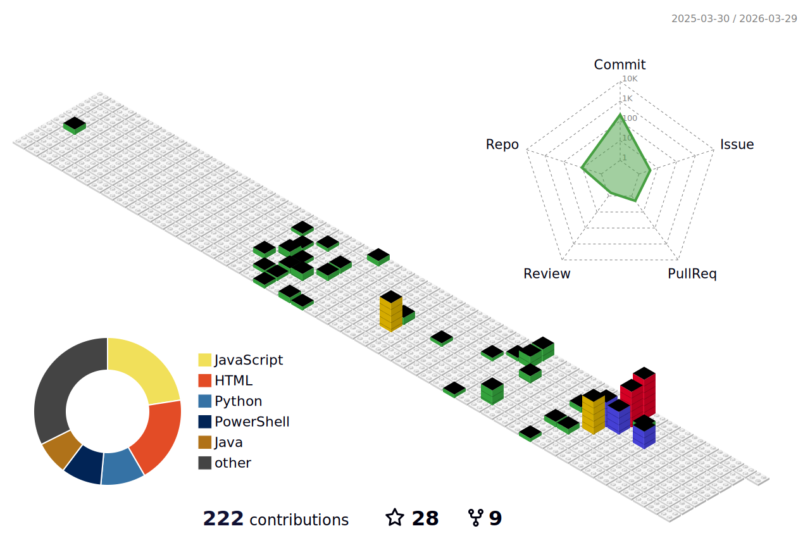

<!-- ====== HEADER ====== -->

# 👋 김진석 | JinSeok Kim | 金鎭奭
<!-- (선택) 한 줄 소개 뱃지 -->

  

  
   
  
  
  

### 🐍 My Contributions Snake

---

<!-- ====== PORTFOLIO SECTIONS ====== -->

<h2>📊 GitHub 활동</h2>

### 📈 GitHub Stats
### 📊 My 3D Contributions

  
  

### 🔥 GitHub Streak

### 🏅 백준 티어

### 📊 활동 요약

| 항목 | 내용 |
|:---:|:---:|
| **총 레포지토리** | 27개 |
| **Followers** | 18명 |
| **Following** | 33명 |
| **총 Stars** | 29개 |
| **활동 기간** | 2023.01 ~ 현재 |

<h2>🚀 프로젝트 & 조직 활동</h2>

### 🚀 창업 - NEXUSCORE (넥서스코어)

**"Next Level Core, IT Innovation for Better Lifestyle"**

| 항목 | 내용 |
|:---|:---|
| **역할** | **CTO (Chief Technology Officer)** & **PM** |
| **파트너** | 김정찬 (기획 및 UI/UX 설계) |
| **개발사 협력** | CLAPON (클랩온) |
| **홈페이지** | [nexuscore.co.kr](https://nexuscore.co.kr) |
| **Contact** | nexuscore@nexuscore.co.kr |
| **GitHub** | [Nexuscore-Partner](https://github.com/Nexuscore-Partner) |

기술의 핵심(Core)을 탐구하고 혁신적인 IT 솔루션을 통해 더 나은 라이프스타일을 설계하는 전략 기획 및 테크니컬 프로젝트 수행

**핵심 역량**: Strategic Planning, AWS EC2/Nginx/PM2 인프라 구축, Flutter 크로스 플랫폼, Supabase, Firebase FCM, SSL 보안

**프로젝트**

| 프로젝트 | 설명 | 도메인 | 링크 |
|:---|:---|:---:|:---:|
| **all4fit** | 피트니스 통합 솔루션 플랫폼 | Health & Wellness, Flutter | [GitHub](https://github.com/Nexuscore-Partner/all4fit) |
| **ESG_Radar** | ESG 레이더 분석 시스템 | Corporate Governance, GPT | [GitHub](https://github.com/Nexuscore-Partner/ESG_Radar) |
| **arbormind-ai** | AI 기반 솔루션 | AI/ML, Python | [GitHub](https://github.com/Nexuscore-Partner/arbormind-ai) |

---

### 🎓 졸업 프로젝트 - SMU-MCP (oneTeam)

**SMUS: AI Agent(Custom MCP-driven)를 활용한 상명대학교 통합 정보 허브**

| 항목 | 내용 |
|:---|:---|
| **역할** | **Data Engineer** (데이터 수집 & DB 관리) |
| **담당** | AWS Lambda 크롤링 시스템 구축, RDS/S3 데이터 파이프라인 설계 |
| **팀 구성** | 김재관, 김정찬, **김진석**, 맹의현, 염다인 (5명) |
| **GitHub** | [oneTeam-MCP](https://github.com/oneTeam-MCP) |

MCP(Model Context Protocol) 기반 AI 에이전트 시스템으로, 학생들의 학사 일정, 과제, 공지사항을 통합 관리하는 대화형 정보 허브

**기술 스택**: Spring Boot, React, AWS (EC2/Lambda/RDS/S3), Docker, Nginx, FastMCP, GPT-4o, LangGraph

**프로젝트**

| 프로젝트 | 설명 | 도메인 | 링크 |
|:---|:---|:---:|:---:|
| **Data_Crawling** | AWS Lambda 크롤링 & 데이터 파이프라인 | Serverless, Data Engineering | [GitHub](https://github.com/oneTeam-MCP/Data_Crawling) |
| **Spring_Boot_MCP_Host** | Spring Boot 기반 MCP Host | MCP Protocol, Java | [GitHub](https://github.com/oneTeam-MCP/Spring_Boot_MCP_Host) ⭐1 |
| **final_mcp_server** | MCP 서버 구현 | FastMCP, Python | [GitHub](https://github.com/oneTeam-MCP/final_mcp_server) |
| **oneTeam_Server** | SMUChat API 서버 | Backend API, Spring | [GitHub](https://github.com/oneTeam-MCP/oneTeam_Server) |
| **oneTeam_Frontend** | 프론트엔드 애플리케이션 | React, TypeScript | [GitHub](https://github.com/oneTeam-MCP/oneTeam_Frontend) |

---

### 🎓 학술 동아리 - BAMBOO

**휴먼과 학술 동아리 홈페이지 개발**

| 항목 | 내용 |
|:---|:---|
| **역할** | **기획 & Full-Stack Developer** |
| **담당** | 서비스 기획, 프론트엔드 & 백엔드 개발 (진행중) |
| **홈페이지** | [smu-bamboo.uk](https://smu-bamboo.uk) |
| **GitHub** | [BAMBOO-Homepage](https://github.com/BAMBOO-Hompage) |

**프로젝트**

| 프로젝트 | 설명 | 도메인 | 링크 |
|:---|:---|:---:|:---:|
| **bamboo-server** | 동아리 홈페이지 서버 | Backend, Spring Boot | [GitHub](https://github.com/BAMBOO-Hompage/bamboo-server) ⭐1 |
| **bamboo-front** | 동아리 홈페이지 프론트 | Frontend, React | [GitHub](https://github.com/BAMBOO-Hompage/bamboo-front) ⭐1 |

---

### 💡 개인 AI/ML 프로젝트

| 프로젝트명 | 설명 | 도메인 | 링크 |
|:---|:---|:---:|:---:|
| **Remote_PPG** | 비접촉 방식 심박수 및 호흡수 실시간 측정 시스템 | Healthcare, Computer Vision | [GitHub](https://github.com/jinseok19/Remote_PPG) |
| **CODEEG** | 뇌파를 이용한 의류 추천 서비스 (EEG 기반) | Neuroscience, Fashion-Tech | [GitHub](https://github.com/jinseok19/CODEEG) ⭐3 |
| **2023_BioHealth_Data_Contest** | 사랑니 발치 후 위험도 예측 모델 개발 | Medical AI, Image Analysis | [GitHub](https://github.com/jinseok19/2023_BioHealth_Data_Contest) |
| **COSSTHON** | AI 피부 분석 서비스 (COSSTHON 3rd) | Beauty-Tech, Skincare AI | [GitHub](https://github.com/jinseok19/COSSTHON) |
| **Weeing-weeing** | 딸기 병 분류 플랫폼 | Agriculture, YOLOv8 | [GitHub](https://github.com/jinseok19/Weeing-weeing) |

---

### 📚 AI-X 선도 인재 양성 프로젝트 (with KT & 상명대)

| 단계 | 프로젝트명 | 설명 | 도메인 |
|:---:|:---|:---|:---:|
| **고급** | Advanced_Level_Project_for_AI-X | 전동킥보드 탐지 시스템 | Object Detection, YOLOv8 | 
| **중급** | Intermediate_Level_Project_for_AI-X | 운동 동기부여 챗봇 | Chatbot, GPT, TTS |
| **기초** | Beginner_Level_Project_for_AI-X | Kaggle 데이터 분석 프로젝트 | Data Science, ML |

---

### 🌐 웹 개발 프로젝트

| 프로젝트명 | 설명 | 도메인 | 링크 |
|:---|:---|:---:|:---:|
| **EcoBuild** | Eco Build 기업 웹사이트 | Corporate Web | [ecobuild.kr](https://ecobuild.kr/) |
| **giantSK** | Giant SK 기업 웹사이트 | Corporate Web, JavaScript | [giant-sk.vercel.app](https://giant-sk.vercel.app) |
| **icehockey_rank** | 아이스하키 클럽 랭킹 전적 조회 사이트 | Sports Analytics, JavaScript | [GitHub](https://github.com/jinseok19/icehockey_rank) |
| **jinseok19.github.io** | 개인 기술 블로그 | Tech Blog, Jekyll | [jinseok19.github.io](https://jinseok19.github.io) |

---

### 🔬 학습 & 연구

| 프로젝트명 | 설명 | 주제 |
|:---|:---|:---:|
| **Python_Machine_Learning** | 파이썬 머신러닝 완벽 가이드 (개정2판) 예제 | Machine Learning |
| **Investment-In-Deep-Learning-Reinforcement-Learning-Stocks** | 딥러닝/강화학습 주식투자 시스템 | RL, Stock Prediction |
| **minimalRL** | 기본 강화학습 알고리즘 구현 (PyTorch) | Reinforcement Learning |
| **llm-response-analysis** | 다양한 LLM 모델 응답 비교 분석 | LLM Analysis |
| **AWS_Elastic_Cloud** | AWS, Elastic Cloud 팀 프로젝트 | Cloud Computing |

<h2>🏆 수상 경력</h2>

| 대회/공모전 | 수상 | 주제/분야 | 팀/역할 | 날짜 |
|:---|:---:|:---|:---:|:---:|
| **Human AI Studio Festival 2025** 상명대학교 융합공과대학 | 🥇 **대상** | 휴먼지능정보공학전공 우수 성과 | oneTeam (Data Engineer) | 2025.11.12 |
| **2025학년도 캡스톤디자인 경진대회** 상명대학교 WIDEEP 교육혁신원 | 🎖️ **입선** | SMU-MCP: AI Agent 통합 정보 허브 | oneTeam (Data Engineer) | 2025.08.22 |
| **제3회 COSSTHON** 상명대학교 바이오헬스 혁신융합대학 | 🎖️ **장려상** | AI 기반 피부 진단 및 맞춤형 화장품 추천 | F팀 | 2024.12.27 |
| **2023 바이오헬스 데이터 AI 경진대회** 홍익대학교 바이오헬스 혁신융합대학 | 🎖️ **장려상** | Track 1. 사랑니 발치 후 위험도 예측 모델 | CopyAndToothpaste | 2023.12.05 |

<h2>📜 자격증</h2>

| 자격증명 | 발급기관 | 취득일 |
|:---|:---:|:---:|
| 추가 예정 | - | - |

> 자세한 자격증 정보는 [certificate 레포](https://github.com/jinseok19/certificate)에서 확인하실 수 있습니다.

<h2>🌐 프로덕션 서비스</h2>

| 서비스명 | 설명 | 도메인 | 상태 |
|:---|:---|:---:|:---:|
| **NEXUSCORE** | IT 혁신 전략 기획 회사 공식 웹사이트 | [nexuscore.co.kr](https://nexuscore.co.kr) | 🟢 Production |
| **BAMBOO** | 상명대학교 휴먼과 학술 동아리 플랫폼 | [smu-bamboo.uk](https://smu-bamboo.uk) | 🟢 Production |
| **EcoBuild** | Eco Build 기업 공식 웹사이트 | [ecobuild.kr](https://ecobuild.kr/) | 🟢 Production |
| **Giant SK** | Giant SK 기업 홈페이지 | [giant-sk.vercel.app](https://giant-sk.vercel.app) | 🟢 Production |
| **Tech Blog** | Jekyll 기반 개인 기술 블로그 | [jinseok19.github.io](https://jinseok19.github.io) | 🟢 Production |

<h2>🔬 특허</h2>

### 등록 특허

| 번호 | 특허명 | 출원번호 (출원일) | IPC/CPC | 출원인 |
|:---:|:---|:---:|:---:|:---:|
| **[1]** | **실시간 객체 탐지 기술을 이용한 PM 위치 탐지 방법 및 시스템** (Method and system for automatic Personal Mobility location detection using real-time object detection technology) | 10-2024-0012439 (2024-01-26) | IPC: G06Q50/40 CPC: B60L2200/24 | 상명대학교산학협력단 |
| **[2]** | **생성형 AI를 통한 상황별 격려 문장 생성 방법 및 장치** (Methods and Devices for Generating Pep Sentences with Generative AI) | 10-2023-0142346 (2023-10-23) | IPC: G06F16/332 CPC: G06F16/3329 | 상명대학교산학협력단 |

### 상세 정보

<b>[1] PM 위치 탐지 시스템 특허 상세</b>

- **키워드**: 객체 탐지, YOLO, Real-time Analysis, Personal Mobility
- **링크**: [특허정보 조회](https://doi.org/10.8080/1020240012439)
- **요약**: 실시간 객체 탐지 기술을 활용하여 퍼스널 모빌리티(PM)의 위치를 자동으로 감지하는 방법 및 시스템

<b>[2] 생성형 AI 격려 문장 생성 특허 상세</b>

- **키워드**: Generative AI, ChatGPT, NLP, Motivation
- **링크**: [특허정보 조회](https://doi.org/10.8080/1020230142346)
- **요약**: 생성형 AI 모델을 활용하여 사용자의 상황에 맞는 맞춤형 격려 문장을 자동으로 생성하는 방법 및 장치

---

<!-- ====== FOOTER ====== -->

### 📫 Contact

